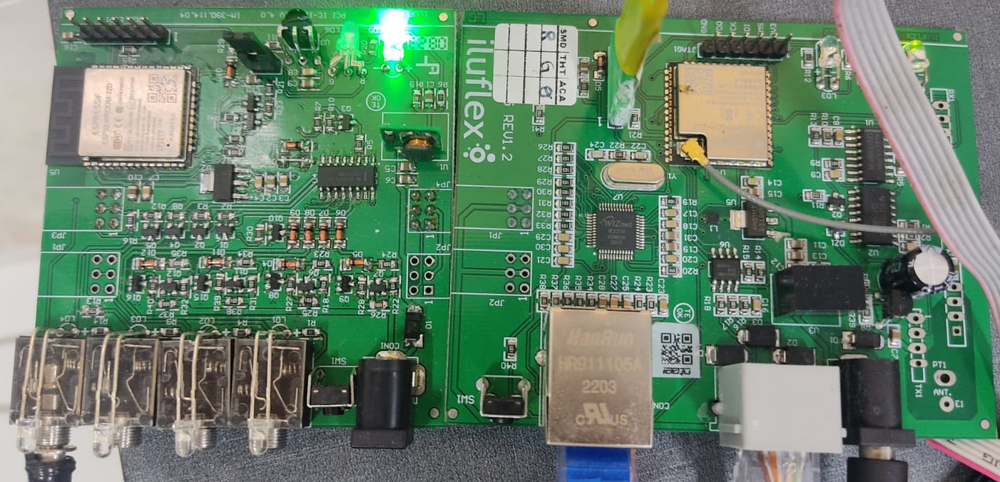
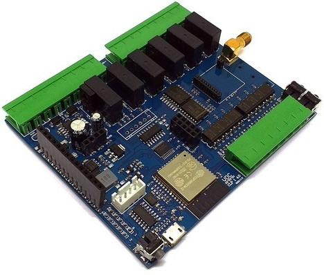
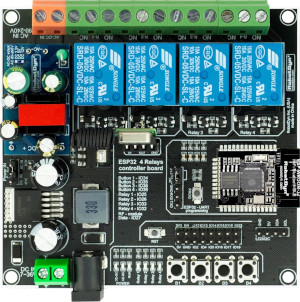
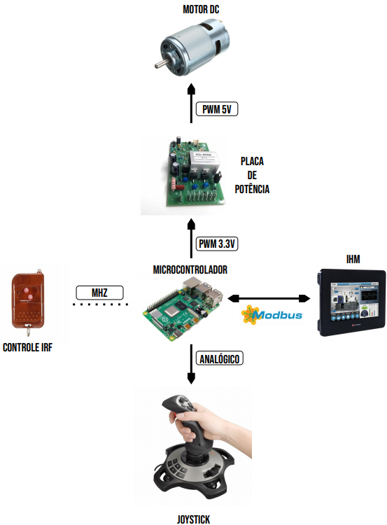
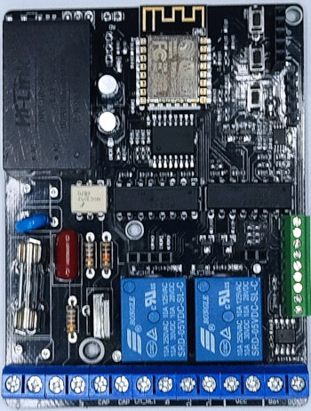
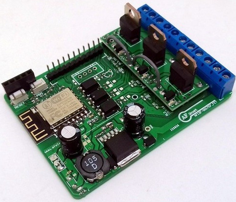

# Portfólio Desenvolvimento
#### Eng. Elton de Sousa e Silva
##### https://www.linkedin.com/in/eltonssilva/

---

#### Sistema para contagem de pessoas em transportes publicos (Cidades Inteligentes)

* Descrição
  * Harware para contagem de pessoas em transportes publicos atraves do sinal de wifi e bluetooth de celulares dos usuarios
  dos onibus.

* Cliente  **Iluflex (https://www.green4t.com/)**
  
* Principais Requisitos
  * Contagem de pessoas via Sniffer BLE e WiFi

* Microcontrolador  **STM-32**

* Linguagem: **C++**

* Status: **Finalizado**

---

#### Sistema Completo para Automação Residencial
* Descrição
  * Sistema completo para automação residencial inteligente, com desenvolvimento de Hardware e Software.

  * Hardware e Software Desenvolvido
  
  1. Placa de Controle Geral da Residencia (Master)
  2. Placa de Controle Infravermelhor
  1. Placa de Controle de iluminação
  1. Placa de Controle de Cargas Pesadas (Motores e bombas)
  1. Placa de Controle de Portão
  1. Placa de Controle de lampadas dimerizaveis.

* Cliente  **Iluflex (https://www.iluflex.com.br/)**
  
* Principais Requisitos
  * Comunicação via WIFI (Rede Mesh) com protocolo proprietario, e comunicação via 485 com protocolo também por nos.

* Microcontrolador  **ESP32-S2, ESP32-C3, ESP32-S3, PIC**

* Sistema Operacional: **FreeRTOS**

* Status: **Finalizado**

---

#### Sistema Completo para Automação Residencial
* Descrição
  * Sistema completo para automação residencial inteligente, com desenvolvimento de Hardware e Software.

* Cliente  **Iluflex (https://www.iluflex.com.br/)**
  
* Principais Requisitos
  * Comunicação via WIFI (Rede Mesh) com protocolo proprietario, e comunicação via 485 com protocolo também por nos.

* Microcontrolador  **ESP32-S2, ESP32-C3, ESP32-S3, PIC**

* Sistema Operacional: **FreeRTOS**

* Status: **Finalizado**

---

#### Maquina de Ração
* Descrição
  * Controle de fabricação de ração através de uma balança e roscas dosadoras
* Cliente  **Fabricas de Ração**
  
* Principais Requisitos
  * Serial 485/ModBus RTU, Ethernet Wifi, IHM

* Microcontrolador  **ESP32**

* Sistema Operacional: **FreeRTOS**

* Status: **Desenvolvimento**

---

#### Sistema de irrigação
* Descrição
  * Sistema para controle de Irrigação inteligente com 4 Zonas individuais de controle.
  
* Principais Requisitos
  * Serial, Ethernet Wifi, Comunicação MQTT
  * Comunicação com Alexa e google Home

* Microcontrolador  **ESP32**

* Sistema Operacional: **FreeRTOS**

---

#### Inspeção de Solda
* Descrição
  * Robo Vertical para inspeção de Solda

  
* Principais Requisitos
  * PWM Motores/Controle Joysticks, Comunicação Lora, Tela LCD

* Microcontrolador  **Raspberry PI 4**

* Sistema Operacional: **Linux/Python**

* Status: **Finalizado**

---

#### Controle de Portão Inteligente
* Descrição
  * Sistema Embarcado para Controle de Portão Inteligente
* Cliente  **AutoDomo Casas Inteligentes**
  
* Principais Requisitos
  * Controle Velocidade Motor, suporte a RF433Mhz, WIFI, BLE, Sistema WEB para Configuração

* Microcontrolador  **ESP8266**

* Sistema Operacional: **ESP8266 RTOS SDK**

* Status: **Finalizado**

---

#### Controle de Luz RGB
* Descrição
  * Sistema para Controle de Lampada RGB
* Cliente  **AutoDomo Casas Inteligentes**
  
* Principais Requisitos
  * Controle PWM Por Cor, Sistema WEB para Configuração

* Microcontrolador  **ESP8266**

* Sistema Operacional: **Bare Metal**

* Status: **Finalizado**

---

#### Aplicativos Desenvolvidos 

##### TopoGrafia APP
* Link
  * https://play.google.com/store/apps/details?id=aguiar.com.br.point_gps
* Descrição
  * Aplicativo Para Levantamento de Redes Eletricas e Telecomunicações.
* Linguagem (Framework)
  * React Native (IOS/Androi)

---

##### AutoDomo
* Link
  * https://play.google.com/store/apps/details?id=io.aguiar.autodomo
* Descrição
* Sistema Completo para Automação Residencial com Suporte a Lais e Google Home
* Linguagem (Framework)
  * React Native (IOS/Androi)

---

##### GeoRede
* Link
  * https://play.google.com/store/apps/details?id=aguiar.com.br.point_gps
* Descrição
  * Aplicativo para georreferenciamento de atividades em campo.
* Linguagem (Framework)
  * React Native (IOS/Androi)

---

##### GeoRede WEB
* Link
  * https://georede.app.br

* Descrição
  * Sistema web para controle das atividades levantadas pelo APP GeoRede
* Caracteristicas
  * Banco de dados (RealTime Database, Firestore)
  * Firebase - Cloud Functions
* Linguagem (Framework)
  * NodeJS/Java Script/ReactJS

---

##### AutoDomo Cloud
* Link
  * autodomo.io
* Descrição
  * Sistema em nuvem (Google Cloud) para gerenciamento de dispositivos inteligentes (IoT)
* Caracteristicas
  * Suporte a Comunicação WebSocket
  * Suporte a Protocolo MQTT
  * Banco de dados (RealTime Database, Firestore)
  * Redis
* Linguagem (Framework)
  * ReactJS/NodeJS (WEB) e Python

---
##### Skills Alexa (AutoDomo)
* Link
  * https://www.amazon.com.br/AutoDomo/dp/B091CZK9FB/ref=sr_1_1?__mk_pt_BR=%C3%85M%C3%85%C5%BD%C3%95%C3%91&crid=3LFPYWXC6NIZB&keywords=autodomo&qid=1642708745&s=alexa-skills&sprefix=autodomo%2Calexa-skills%2C247&sr=1-1

* Descrição
  * Skill Alexa para Controle de lâmpadas (Ligar e Desligar) e outros dispositivos inteligentes atraves do sistema autodomo
* Caracteristicas
  * Banco de dados DynamoDB
  * API Gateway AWS
  * Lambda AWS
  * Login Auth0
* Linguagem (Framework)
  * NodeJS/JavaScript
---
  ##### Google Action (AutoDomo)

* Descrição
  * Action no Google Assistente para Controle de lâmpadas (Ligar e Desligar) e outros dispositivos inteligentes atraves do sistema autodomo
* Caracteristicas
  * Banco de dados DynamoDB
  * API Gateway AWS
  * Lambda AWS
  * Login Auth0
* Linguagem (Framework)
  * NodeJS/JavaScript

  ---
  ##### Curso Ministrado

* Link
  * https://www.udemy.com/course/automacao-residencial-e-iot-teoria-e-pratica
* Descrição
  * Curso desenvolvido por mim para ensino de programação em dispostivos Embarcados com base no microcontrolador ESP8266. 
* Linguagem (Framework)
  * C++

