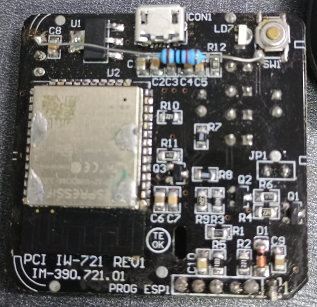
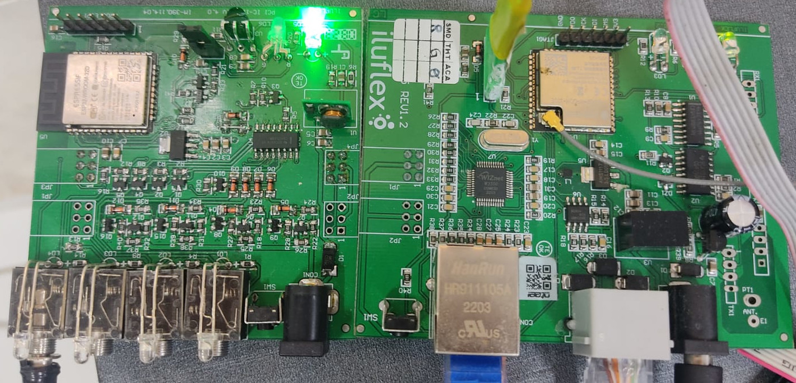
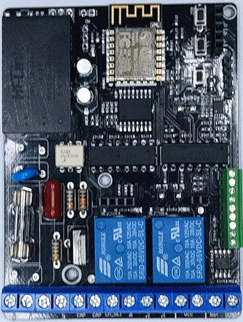
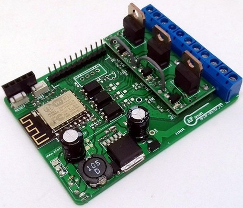

# Development Portfolio
#### Eng. Elton de Sousa e Silva
##### [LinkedIn Profile](https://www.linkedin.com/in/eltonssilva/)

---

#### Home Assistant Addon and PCBA for Home Automation

* Description
  * AutoDomo Addon for remote access and Alexa control of the Home Assistant system.

* Link: **[AutoDomo Addon](https://github.com/eltonssilva/ha_autodomo)**
  
* Main Requirements
  * Embedded Linux, CAN Network, 4G, AWS

* AWS Features
  * DynamoDB database
  * AWS API Gateway
  * AWS Lambda
  * Auth0 Login
  * EC2

* Printed Circuit Board
  * Firmware and Hardware Development

* Language (Framework)
  * NodeJS/JavaScript/Python

* Status: **Completed**

---

#### Monitoring and Control System for Garbage Collection Trucks (Smart Cities)

* Description
  * System using Embedded Linux (Yocto Project) for monitoring garbage collection trucks via CAN Network.

* Client: **[Iluflex](https://www.green4t.com/)**
  
* Main Requirements
  * Embedded Linux, CAN Network, 4G

* System: **Raspberry PI**

* OS: **Embedded Linux**

* Status: **Completed**

---

#### Passenger Counting System in Public Transport (Smart Cities)

* Description
  * Hardware for counting people in public transport through the WiFi and Bluetooth signals of users' mobile phones.

* Client: **[Iluflex](https://www.green4t.com/)**
  
* Main Requirements
  * People counting via BLE and WiFi Sniffer

* Microcontroller: **STM-32**

* Language: **C++**

* Status: **Completed**

---

#### Complete Home Automation System

* Description
  * Complete intelligent home automation system, with Hardware and Software development.

  * Hardware and Software Developed
  
  1. Main Control Board (Master)
  2. Infrared Control Board
  3. Lighting Control Board
  4. Heavy Loads Control Board (Motors and pumps)
  5. Gate Control Board
  6. Dimmable Lamps Control Board.

* Client: **[Iluflex](https://www.iluflex.com.br/)**
  
* Main Requirements
  * Communication via WIFI (Mesh Network) with proprietary protocol, and communication via 485 with protocol also developed by us.

* Microcontroller: **ESP32-S2, ESP32-C3, ESP32-S3, PIC**

* Operating System: **FreeRTOS**

* Status: **Completed**

---

#### Feed Machine

* Description
  * Control of feed manufacturing through a scale and dosing screws.
* Client: **Feed Factories**
  
* Main Requirements
  * Serial 485/ModBus RTU, Ethernet Wifi, HMI

* Microcontroller: **ESP32**

* Operating System: **FreeRTOS**

* Status: **In Development**

---

#### Irrigation System

* Description
  * Intelligent irrigation control system with 4 individual control zones.
  
* Main Requirements
  * Serial, Ethernet Wifi, MQTT Communication
  * Communication with Alexa and Google Home

* Microcontroller: **ESP32**

* Operating System: **FreeRTOS**

---

#### Welding Inspection

* Description
  * Vertical Robot for Welding Inspection

* Main Requirements
  * Motor PWM/Joystick Control, LoRa Communication, LCD Screen

* Microcontroller: **Raspberry PI 4**

* Operating System: **Linux/Python**

* Status: **Completed**

---

#### Intelligent Gate Control

* Description
  * Embedded System for Intelligent Gate Control
* Client: **AutoDomo Smart Homes**
  
* Main Requirements
  * Motor Speed Control, RF433Mhz support, WIFI, BLE, Web System for Configuration

* Microcontroller: **ESP8266**

* Operating System: **ESP8266 RTOS SDK**

* Status: **Completed**

---

#### RGB Light Control

* Description
  * System for RGB Lamp Control
* Client: **AutoDomo Smart Homes**
  
* Main Requirements
  * PWM Control per Color, Web System for Configuration

* Microcontroller: **ESP8266**

* Operating System: **Bare Metal**

* Status: **Completed**

---

#### Developed Applications

##### TopoGrafia APP
* Link
  * [TopoGrafia APP](https://play.google.com/store/apps/details?id=aguiar.com.br.point_gps)
* Description
  * App for Electrical and Telecommunication Network Survey.
* Language (Framework)
  * React Native (iOS/Android)

---

##### AutoDomo
* Link
  * [AutoDomo](https://play.google.com/store/apps/details?id=io.aguiar.autodomo)
* Description
  * Complete Home Automation System with Alexa and Google Home Support.
* Language (Framework)
  * React Native (iOS/Android)

---

##### GeoRede
* Link
  * [GeoRede](https://play.google.com/store/apps/details?id=aguiar.com.br.point_gps)
* Description
  * App for georeferencing field activities.
* Language (Framework)
  * React Native (iOS/Android)

---

##### GeoRede WEB
* Link
  * [GeoRede WEB](https://georede.app.br)
* Description
  * Web system for controlling activities surveyed by the GeoRede APP.
* Features
  * Database (RealTime Database, Firestore)
  * Firebase - Cloud Functions
* Language (Framework)
  * NodeJS/JavaScript/ReactJS

---

##### AutoDomo Cloud
* Link
  * [AutoDomo Cloud](https://autodomo.io)
* Description
  * Cloud system (Google Cloud) for managing smart devices (IoT).
* Features
  * WebSocket Communication Support
  * MQTT Protocol Support
  * Database (RealTime Database, Firestore)
  * Redis
* Language (Framework)
  * ReactJS/NodeJS (WEB) and Python

---

##### Alexa Skills (AutoDomo)
* Link
  * [Alexa Skills](https://www.amazon.com.br/AutoDomo/dp/B091CZK9FB/ref=sr_1_1?__mk_pt_BR=%C3%85M%C3%85%C5%BD%C3%95%C3%91&crid=3LFPYWXC6NIZB&keywords=autodomo&qid=1642708745&s=alexa-skills&sprefix=autodomo%2Calexa-skills%2C247&sr=1-1)
* Description
  * Alexa Skill for controlling lights (On and Off) and other smart devices through the AutoDomo system.
* Features
  * DynamoDB database
  * AWS API Gateway
  * AWS Lambda
  * Auth0 Login
* Language (Framework)
  * NodeJS/JavaScript

---

##### Google Action (AutoDomo)
* Description
  * Google Assistant Action for controlling lights (On and Off) and other smart devices through the AutoDomo system.
* Features
  * DynamoDB database
  * AWS API Gateway
  * AWS Lambda
  * Auth0 Login
* Language (Framework)
  * NodeJS/JavaScript

---

##### Course Offered

* Link
  * [Udemy Course](https://www.udemy.com/course/automacao-residencial-e-iot-teoria-e-pratica)
* Description
  * Course developed by me for teaching programming in embedded devices based on the ESP8266 microcontroller.
* Language (Framework)
  * C++